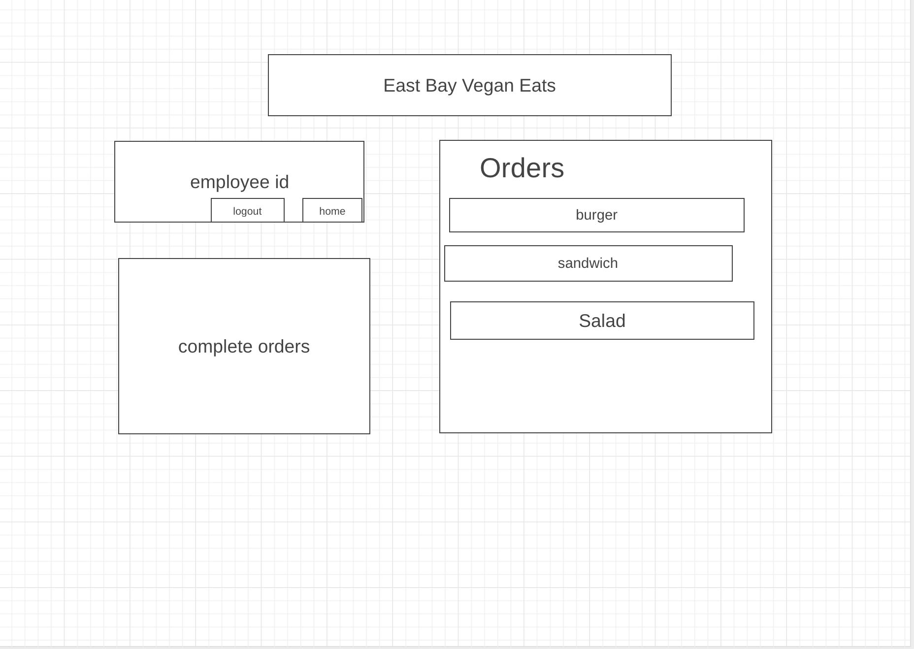

# Project-2

# East Bay Vegan Eats
An app that allows employees to place customers orders.

## Technologies Used 
- HTML5
- CSS3
- Javascript
- Node.js
- Bootstrap
- Mongoose.js
- MongoDB
- Express.js
- Morgan
- EJS
- heroku

## Screenshots
### Wireframes

### Images

## Future Enhancements
Be able to add a full menu with drinks

